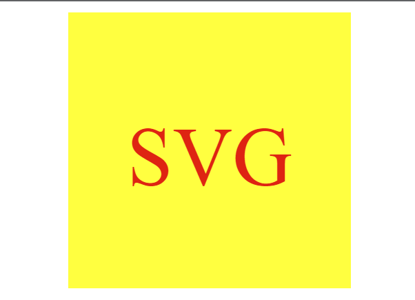

  # SVG Logo Maker
  
 
 Licensing: [mit](https://choosealicense.com/licenses/mit/)
  
  ## Table of Contents

  - [Description](#description)
  - [Installation](#installation-requirements)
  - [Usage](#application-usage)
  - [License](#licensing-information)
  - [Contributions](#contributions)
  - [Tests](#tests-commands)
  - [Video Link](#link-to-video-instructions)
  - [Screenshot](#screenshot)
  - [Questions](#questions)

  ## Description
  A Scalable Vector Graphic Application that allows user input to create dynamic logos. 

  ## Installation Requirements
  inquirer@8.2.4

  ## Application Usage
  Utilize the SVG Logo Maker to design dynamic SVG logos through user inputs. SVG Logo Maker provides recommendations for beginners, but can offer scalability if familiar with SVG and XML values.
  
  ## Contributions
  Eric Keeton

  ## Test Commands
  node index.js

  ## Link to Video Instructions
  https://drive.google.com/file/d/14_WdimHO8REPdgeeClWmb1ygPJfLZ60B/view

  ## Screenshot
  
  

  ## Questions
  For Questions, contact me at emk2473@gmail.com or visit My Github: [EMK2473](https://github.com/EMK2473)

